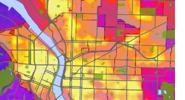

This is normal text. The first header section is what will be displayed on the top of the page. Ignore the title for now.

Note that to start a new paragraph, you need to have a whole line break in between the two.

### Example links and stuff
[I'm an inline-style link](https://www.google.com)

### This is a header 3
You can tell because it has three \#'s in a row. Try not to use header 1 or 2 (they're really big).

### Images!




### This is how you do code and stuff
Please make sure to put the python code you used in your markdown!
```python
QgsVectorFileWriter.writeAsVectorFormat(LAYERVARIABLE_name_selectedfeatures, r'C:/Users/ges_student/Desktop/OUTPUT_name.gpkg', 'utf-8', LAYERVARIABLE_name_selectedfeatures.crs(),'GPKG', True)
```